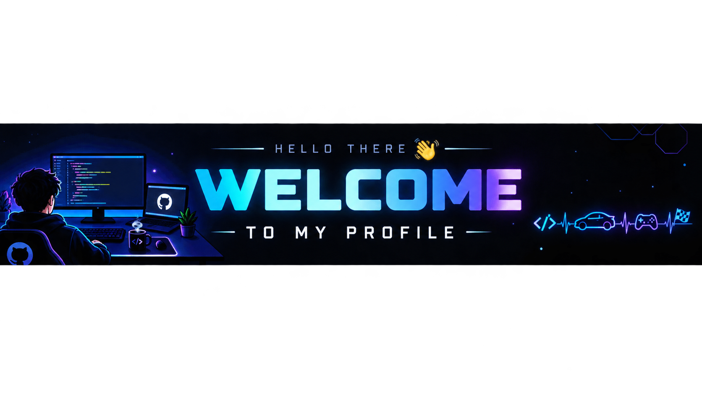

# Hi there, I'm Sneakysen! 👋

  

 · Open Source · DevRel
 

---

## 🚀 DevRel

**Open Source Developer Advocate**

> I believe Open Source is for **EVERYONE** — yes, YOU!  
> Let's build, learn and geek out together. 🤓

---

## 🧑‍💻 About Me

<table>
<tr>
<td width="55%">

### Hey there! 👋

I'm passionate about:

- 🌎 Open Source
- 📱 AOSP
- ❤️ Custom ROM and MODDS
- 🧑‍💻 Developer Relations
- 🎥 Developer content
- 🚀 Building communities
- 🤝 Helping developers grow

I love turning ideas into projects and helping people discover the power of Open Source.

</td>

<td width="45%" align="center">

</td>
</tr>
</table>

---
---

## 🛠️ Technologies

---

## 📈 GitHub Contributions

---

## 💬 Let's Connect

---

### ⭐ Thanks for visiting!

**If you find my projects useful, consider giving them a star!**

